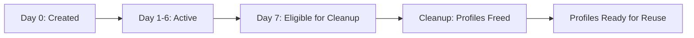

## Endpoint

<CodeGroup>
```bash cURL
curl -X POST http://localhost:5001/api/cleanup \
  -H "X-Base-Id: your-base-id" \
  -H "Content-Type: application/json"
```

```typescript TypeScript
import { apiPost } from '@/lib/api'
import { useBase } from '@/contexts/base-context'

const { baseId } = useBase()

const response = await apiPost('/api/cleanup', baseId)
```

```javascript JavaScript
const response = await fetch('http://localhost:5001/api/cleanup', {
  method: 'POST',
  headers: {
    'X-Base-Id': 'your-base-id',
    'Content-Type': 'application/json'
  }
})

const data = await response.json()
```
</CodeGroup>

## Description

Cleans up campaigns that are 7+ days old, freeing their assigned profiles for reuse. This endpoint should be run daily as a scheduled cron job.

This endpoint:
1. Identifies campaigns older than 7 days
2. Retrieves all assignments for those campaigns
3. Marks assigned profiles as unused (`used = false`)
4. Deletes campaign assignments from `daily_assignments` table
5. Optionally deletes campaign records from `campaigns` table
6. Returns cleanup statistics

<Info>
  This is a critical maintenance operation that prevents profile pool exhaustion. Run daily at 2 AM.
</Info>

## Request Headers

<ParamField header="X-Base-Id" type="string" required>
  Airtable base identifier for multi-tenant isolation
</ParamField>

<ParamField header="Content-Type" type="string" default="application/json">
  Must be `application/json`
</ParamField>

## Request Body

This endpoint does not require a request body.

## Response Fields

<ResponseField name="success" type="boolean" required>
  Indicates if cleanup completed successfully
</ResponseField>

<ResponseField name="campaigns_cleaned" type="number" required>
  Number of campaigns cleaned up
</ResponseField>

<ResponseField name="profiles_freed" type="number" required>
  Total number of profiles marked as unused
</ResponseField>

<ResponseField name="deleted_campaigns" type="string[]">
  Array of campaign IDs that were cleaned up
</ResponseField>

## Response Example

### Success Response (200 OK)

```json
{
  "success": true,
  "campaigns_cleaned": 5,
  "profiles_freed": 72000
}
```

### Success with Details (200 OK)

```json
{
  "success": true,
  "campaigns_cleaned": 3,
  "profiles_freed": 43200,
  "deleted_campaigns": [
    "550e8400-e29b-41d4-a716-446655440000",
    "6ba7b810-9dad-11d1-80b4-00c04fd430c8",
    "7c9e6679-7425-40de-944b-e07fc1f90ae7"
  ]
}
```

### No Cleanup Needed (200 OK)

```json
{
  "success": true,
  "campaigns_cleaned": 0,
  "profiles_freed": 0,
  "message": "No campaigns older than 7 days found"
}
```

### Error Response (401 Unauthorized)

```json
{
  "success": false,
  "error": "X-Base-Id header is required"
}
```

### Error Response (500 Internal Server Error)

```json
{
  "success": false,
  "error": "Cleanup failed",
  "details": {
    "message": "Database transaction error",
    "campaigns_processed": 2,
    "profiles_freed": 28800
  }
}
```

## Cleanup Logic

The endpoint performs cleanup in the following order:

```typescript
// Pseudo-code for cleanup logic
const cleanupOldCampaigns = async () => {
  const sevenDaysAgo = new Date()
  sevenDaysAgo.setDate(sevenDaysAgo.getDate() - 7)

  // 1. Find campaigns older than 7 days
  const oldCampaigns = await db.query(`
    SELECT campaign_id, created_at
    FROM campaigns
    WHERE created_at < $1
    ORDER BY created_at ASC
  `, [sevenDaysAgo])

  let profilesFreed = 0

  for (const campaign of oldCampaigns) {
    // 2. Get all assignments for this campaign
    const assignments = await db.query(`
      SELECT username
      FROM daily_assignments
      WHERE campaign_id = $1
    `, [campaign.campaign_id])

    // 3. Mark profiles as unused
    await db.query(`
      UPDATE global_usernames
      SET used = false
      WHERE username IN ($1)
    `, [assignments.map(a => a.username)])

    // 4. Delete assignments
    await db.query(`
      DELETE FROM daily_assignments
      WHERE campaign_id = $1
    `, [campaign.campaign_id])

    // 5. Optionally delete campaign record
    await db.query(`
      DELETE FROM campaigns
      WHERE campaign_id = $1
    `, [campaign.campaign_id])

    profilesFreed += assignments.length
  }

  return {
    campaigns_cleaned: oldCampaigns.length,
    profiles_freed: profilesFreed
  }
}
```

## Campaign Lifecycle

Campaigns follow a 7-day lifecycle:



**Timeline:**
- **Day 0:** Campaign created, profiles assigned
- **Days 1-6:** VAs work on profiles in Airtable
- **Day 7:** Campaign becomes eligible for cleanup
- **Day 7+:** Cleanup runs, profiles marked as unused

## Scheduled Execution

This endpoint should be run as a daily cron job:

### Linux Cron

```bash crontab
# Run cleanup daily at 2 AM
0 2 * * * curl -X POST http://localhost:5001/api/cleanup \
  -H "X-Base-Id: your-base-id" \
  -H "Content-Type: application/json"
```

### Node.js Cron (node-cron)

```typescript
import cron from 'node-cron'
import { apiPost } from './lib/api'

// Run cleanup daily at 2 AM
cron.schedule('0 2 * * *', async () => {
  console.log('Running daily cleanup...')
  
  const response = await apiPost('/api/cleanup', baseId)
  
  if (response.success) {
    console.log(`Cleaned ${response.campaigns_cleaned} campaigns`)
    console.log(`Freed ${response.profiles_freed} profiles`)
  }
})
```

### Vercel Cron (vercel.json)

```json
{
  "crons": [{
    "path": "/api/cron/cleanup",
    "schedule": "0 2 * * *"
  }]
}
```

With API route:

```typescript
// app/api/cron/cleanup/route.ts
import { NextResponse } from 'next/server'

export async function GET(request: Request) {
  const apiUrl = process.env.NEXT_PUBLIC_API_URL
  const baseId = process.env.AIRTABLE_BASE_ID

  const response = await fetch(`${apiUrl}/api/cleanup`, {
    method: 'POST',
    headers: {
      'X-Base-Id': baseId,
      'Content-Type': 'application/json'
    }
  })

  const data = await response.json()
  return NextResponse.json(data)
}
```

## Database Impact

Cleanup operations affect three tables:

### 1. global_usernames

```sql
-- Mark profiles as unused
UPDATE global_usernames
SET used = false
WHERE username IN (
  SELECT username
  FROM daily_assignments
  WHERE campaign_id IN (/* old campaign IDs */)
);
```

### 2. daily_assignments

```sql
-- Delete old assignments
DELETE FROM daily_assignments
WHERE campaign_id IN (
  SELECT campaign_id
  FROM campaigns
  WHERE created_at < NOW() - INTERVAL '7 days'
);
```

### 3. campaigns (optional)

```sql
-- Delete old campaign records
DELETE FROM campaigns
WHERE created_at < NOW() - INTERVAL '7 days';
```

## Performance Considerations

<Warning>
  Cleanup operations can be resource-intensive:
  - **Large campaigns:** 14,400 profile updates per campaign
  - **Multiple campaigns:** 5-10 campaigns = 72,000-144,000 updates
  - **Execution time:** 30-60 seconds for typical loads
</Warning>

**Optimization Tips:**
- Run during off-peak hours (2 AM)
- Use batch updates (UPDATE with IN clause)
- Index `campaign_id` in `daily_assignments` table
- Use database connection pooling
- Monitor execution time and adjust if needed

## Monitoring Cleanup

Track cleanup operations:

```sql
-- Check campaigns eligible for cleanup
SELECT 
  campaign_id,
  campaign_date,
  created_at,
  EXTRACT(DAY FROM NOW() - created_at) as age_days
FROM campaigns
WHERE created_at < NOW() - INTERVAL '7 days'
ORDER BY created_at;

-- Check total profiles that will be freed
SELECT COUNT(*) as profiles_to_free
FROM daily_assignments
WHERE campaign_id IN (
  SELECT campaign_id
  FROM campaigns
  WHERE created_at < NOW() - INTERVAL '7 days'
);
```

## Error Handling

Common error scenarios:

### Partial Cleanup Failure

**Cause:** Database error during transaction

**Solution:** 
1. Cleanup is transactional (all-or-nothing per campaign)
2. Check logs for specific campaign that failed
3. Retry cleanup on next scheduled run

### Lock Timeout

**Cause:** Long-running update conflicting with other queries

**Solution:**
1. Run during off-peak hours
2. Increase database lock timeout settings
3. Process campaigns in smaller batches

### No Campaigns to Clean

**Cause:** All campaigns are less than 7 days old

**Solution:** This is normal; endpoint returns success with 0 campaigns cleaned

## Profile Pool Management

Cleanup is essential for maintaining a healthy profile pool:

```typescript
// Check profile pool status
const getPoolStatus = async () => {
  // Total unique profiles
  const total = await db.query(
    'SELECT COUNT(*) FROM global_usernames'
  )

  // Unused profiles
  const unused = await db.query(
    'SELECT COUNT(*) FROM global_usernames WHERE used = false'
  )

  // Used profiles
  const used = total - unused

  // Days until pool exhaustion (at 14,400/day)
  const daysRemaining = Math.floor(unused / 14400)

  return {
    total,
    unused,
    used,
    daysRemaining,
    status: daysRemaining >= 7 ? 'healthy' : 'warning'
  }
}
```

**Healthy Pool Indicators:**
- Unused profiles ≥ 100,800 (7 days × 14,400)
- Cleanup running successfully daily
- Profile reuse rate < 30 days

## Testing Cleanup

Test cleanup in development:

```bash
# Create test campaign 8 days ago
psql -c "UPDATE campaigns 
  SET created_at = NOW() - INTERVAL '8 days' 
  WHERE campaign_id = 'test-campaign-id';"

# Run cleanup
curl -X POST http://localhost:5001/api/cleanup \
  -H "X-Base-Id: test-base-id" \
  -H "Content-Type: application/json"

# Verify profiles freed
psql -c "SELECT COUNT(*) 
  FROM global_usernames 
  WHERE used = false;"
```

## Cleanup History

Track cleanup history with a dedicated table:

```sql
-- Optional: Create cleanup history table
CREATE TABLE cleanup_history (
  id UUID PRIMARY KEY DEFAULT uuid_generate_v4(),
  campaigns_cleaned INTEGER,
  profiles_freed INTEGER,
  executed_at TIMESTAMP DEFAULT NOW()
);

-- Log each cleanup run
INSERT INTO cleanup_history (campaigns_cleaned, profiles_freed)
VALUES (5, 72000);

-- View cleanup trends
SELECT 
  DATE(executed_at) as cleanup_date,
  SUM(campaigns_cleaned) as total_campaigns,
  SUM(profiles_freed) as total_profiles
FROM cleanup_history
GROUP BY DATE(executed_at)
ORDER BY cleanup_date DESC
LIMIT 30;
```

## Related Endpoints

<CardGroup cols={2}>
  <Card title="Daily Selection" icon="calendar-days" href="/api/daily-selection">
    Create campaigns that will be cleaned up later
  </Card>
  
  <Card title="Distribute" icon="users" href="/api/distribute">
    Distribute profiles to VA tables
  </Card>
  
  <Card title="Airtable Sync" icon="cloud-arrow-up" href="/api/airtable-sync">
    Sync profiles to Airtable
  </Card>
  
  <Card title="API Overview" icon="book" href="/api/overview">
    View complete API documentation
  </Card>
</CardGroup>