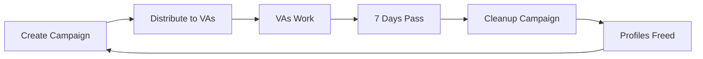

## Endpoint

<CodeGroup>
```bash cURL
curl -X POST http://localhost:5001/api/daily-selection \
  -H "X-Base-Id: your-base-id" \
  -H "Content-Type: application/json"
```

```typescript TypeScript
import { apiPost } from '@/lib/api'
import { useBase } from '@/contexts/base-context'

const { baseId } = useBase()

const response = await apiPost('/api/daily-selection', baseId)
```

```javascript JavaScript
const response = await fetch('http://localhost:5001/api/daily-selection', {
  method: 'POST',
  headers: {
    'X-Base-Id': 'your-base-id',
    'Content-Type': 'application/json'
  }
})

const data = await response.json()
```
</CodeGroup>

## Description

Creates a new campaign and selects 14,400 unused profiles from the `global_usernames` table. This is the first step in the VA assignment workflow.

This endpoint:
1. Creates a new campaign record in `campaigns` table
2. Selects 14,400 unused profiles (where `used = false`)
3. Marks selected profiles as used (sets `used = true`)
4. Returns campaign details

<Info>
  This endpoint requires at least 14,400 unused profiles in the database. Check availability with the Username Status component.
</Info>

## Request Headers

<ParamField header="X-Base-Id" type="string" required>
  Airtable base identifier for multi-tenant isolation
</ParamField>

<ParamField header="Content-Type" type="string" default="application/json">
  Must be `application/json`
</ParamField>

## Request Body

This endpoint does not require a request body.

## Response Fields

<ResponseField name="success" type="boolean" required>
  Indicates if the campaign was created successfully
</ResponseField>

<ResponseField name="campaign_id" type="string" required>
  UUID of the created campaign
</ResponseField>

<ResponseField name="total_selected" type="number" required>
  Number of profiles selected (always 14,400)
</ResponseField>

<ResponseField name="campaign_date" type="string" required>
  Campaign date in YYYY-MM-DD format
</ResponseField>

## Response Example

### Success Response (200 OK)

```json
{
  "success": true,
  "campaign_id": "550e8400-e29b-41d4-a716-446655440000",
  "total_selected": 14400,
  "campaign_date": "2025-10-06"
}
```

### Error Response (400 Bad Request)

```json
{
  "success": false,
  "error": "Insufficient unused profiles",
  "details": {
    "required": 14400,
    "available": 8520
  }
}
```

### Error Response (401 Unauthorized)

```json
{
  "success": false,
  "error": "X-Base-Id header is required"
}
```

### Error Response (500 Internal Server Error)

```json
{
  "success": false,
  "error": "Campaign creation failed",
  "details": {
    "message": "Database transaction error",
    "stage": "profile_selection"
  }
}
```

## Database Schema

### campaigns Table

Stores campaign metadata:

```sql
CREATE TABLE campaigns (
  campaign_id UUID PRIMARY KEY DEFAULT uuid_generate_v4(),
  campaign_date DATE NOT NULL,
  total_assigned INTEGER NOT NULL,
  status TEXT CHECK (status IN ('pending', 'success', 'failed')),
  created_at TIMESTAMP DEFAULT NOW()
);
```

**Status Values:**
- `pending` - Campaign created, distribution in progress
- `success` - Campaign completed successfully
- `failed` - Campaign failed during distribution or sync

### global_usernames Table

Profiles are selected from this table:

```sql
CREATE TABLE global_usernames (
  username TEXT PRIMARY KEY,
  used BOOLEAN DEFAULT FALSE,
  created_at TIMESTAMP DEFAULT NOW()
);
```

## Campaign Workflow

This endpoint is part of a 3-step process:

```typescript
const runCampaignWorkflow = async () => {
  try {
    // Step 1: Create campaign and select profiles (0-33%)
    const selectionResponse = await apiPost('/api/daily-selection', baseId)
    
    if (!selectionResponse.success) {
      throw new Error('Campaign creation failed')
    }
    
    const { campaign_id } = selectionResponse

    // Step 2: Distribute to VA tables (33-66%)
    const distributeResponse = await apiPost(
      `/api/distribute/${campaign_id}`,
      baseId
    )

    if (!distributeResponse.success) {
      throw new Error('Distribution failed')
    }

    // Step 3: Sync to Airtable (66-100%)
    const syncResponse = await apiPost(
      `/api/airtable-sync/${campaign_id}`,
      baseId
    )

    if (syncResponse.success) {
      console.log('Campaign completed successfully')
    }
  } catch (error) {
    console.error('Campaign workflow failed:', error)
  }
}
```

## Selection Logic

The endpoint uses the following SQL query pattern:

```sql
-- Select 14,400 unused profiles
SELECT username 
FROM global_usernames 
WHERE used = false 
ORDER BY created_at ASC 
LIMIT 14400;

-- Mark selected profiles as used
UPDATE global_usernames 
SET used = true 
WHERE username IN (/* selected usernames */);
```

<Info>
  Profiles are selected in FIFO order (oldest first) to ensure even distribution over time.
</Info>

## Daily Target Configuration

The selection target (14,400) is configurable via environment variables:

```bash .env.local
NEXT_PUBLIC_DAILY_SELECTION_TARGET=14400
```

**Breakdown:**
- **Total Profiles:** 14,400
- **VA Count:** 80
- **Profiles per VA:** 180

## Checking Profile Availability

Before creating a campaign, check if sufficient profiles are available:

```sql
-- Check unused profile count
SELECT COUNT(*) as available_profiles
FROM global_usernames
WHERE used = false;
```

Frontend components display this information:

```typescript
// In UsernameStatusCard component
const { data: usernameCount } = await supabase
  .from('global_usernames')
  .select('*', { count: 'exact', head: true })
  .eq('used', false)

const isReady = usernameCount >= 14400
```

## Performance Considerations

<Warning>
  Campaign creation involves two database transactions:
  1. Creating campaign record
  2. Updating 14,400 profile records
  
  Expect 5-15 seconds for completion.
</Warning>

**Optimization Tips:**
- Ensure `global_usernames.used` column is indexed
- Use database connection pooling
- Run during off-peak hours
- Monitor database query performance

## Error Handling

Common error scenarios:

### Insufficient Profiles

**Cause:** Less than 14,400 unused profiles available

**Solution:** 
1. Run `/api/scrape-followers` to add more profiles
2. Run `/api/ingest` to save scraped profiles
3. Check if old campaigns can be cleaned up with `/api/cleanup`

### Database Transaction Failed

**Cause:** Transaction timeout or deadlock

**Solution:** 
1. Retry the request
2. Check database connection limits
3. Verify no other long-running queries

### Campaign Already Exists for Today

**Cause:** Campaign already created for current date

**Solution:** 
1. Wait until next day
2. Or modify `campaign_date` logic to allow multiple daily campaigns

## Campaign Lifecycle

Campaigns follow a 7-day lifecycle:

1. **Day 0:** Campaign created, profiles distributed to VAs
2. **Days 1-6:** VAs work on assigned profiles
3. **Day 7:** Campaign cleaned up via `/api/cleanup`
4. **Post-cleanup:** Profiles marked as unused, ready for reuse



## Monitoring Campaigns

Query campaigns table to monitor status:

```sql
-- View recent campaigns
SELECT 
  campaign_id,
  campaign_date,
  total_assigned,
  status,
  created_at
FROM campaigns
ORDER BY created_at DESC
LIMIT 10;

-- Check campaign status distribution
SELECT 
  status,
  COUNT(*) as count
FROM campaigns
GROUP BY status;
```

## Related Endpoints

<CardGroup cols={2}>
  <Card title="Distribute" icon="users" href="/api/distribute">
    Distribute profiles to VA tables
  </Card>
  
  <Card title="Airtable Sync" icon="cloud-arrow-up" href="/api/airtable-sync">
    Sync profiles to Airtable
  </Card>
  
  <Card title="Cleanup" icon="trash" href="/api/cleanup">
    Clean up old campaigns
  </Card>
  
  <Card title="Ingest" icon="database" href="/api/ingest">
    Add more profiles to database
  </Card>
</CardGroup>