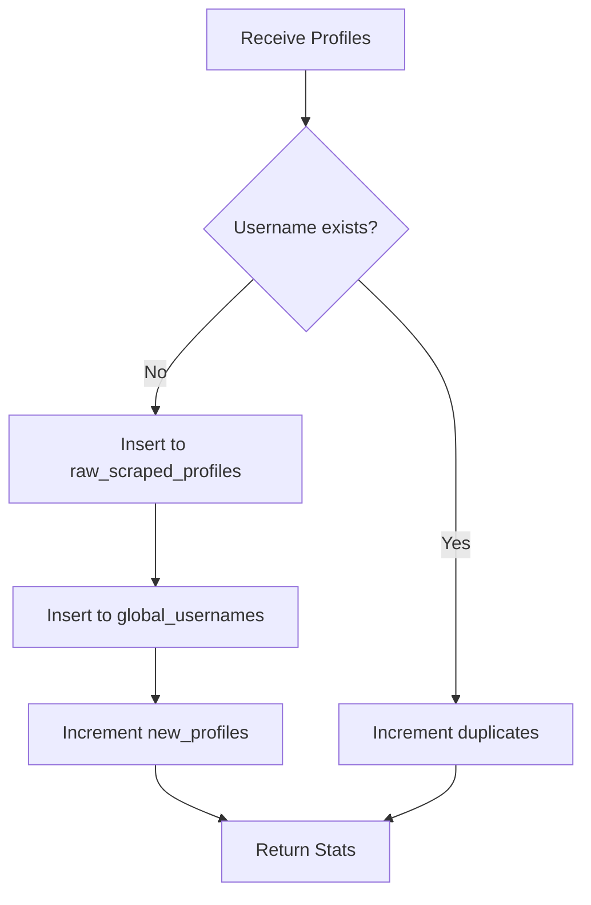

## Endpoint

<CodeGroup>
```bash cURL
curl -X POST http://localhost:5001/api/ingest \
  -H "X-Base-Id: your-base-id" \
  -H "Content-Type: application/json" \
  -d '{
    "profiles": [
      {
        "id": "123456789",
        "username": "john_doe",
        "full_name": "John Doe",
        "detected_gender": "male"
      }
    ]
  }'
```

```typescript TypeScript
import { apiPost } from '@/lib/api'
import { useBase } from '@/contexts/base-context'

const { baseId } = useBase()

const response = await apiPost('/api/ingest', baseId, {
  profiles: scrapedProfiles
})
```

```javascript JavaScript
const response = await fetch('http://localhost:5001/api/ingest', {
  method: 'POST',
  headers: {
    'X-Base-Id': 'your-base-id',
    'Content-Type': 'application/json'
  },
  body: JSON.stringify({
    profiles: scrapedProfiles
  })
})

const data = await response.json()
```
</CodeGroup>

## Description

Ingests scraped Instagram profiles into the Supabase database with automatic deduplication. Uses a two-table strategy:

1. **raw_scraped_profiles** - Stores complete profile data
2. **global_usernames** - Maintains deduplicated username pool

This endpoint:
- Validates profile data structure
- Inserts profiles into `raw_scraped_profiles` table
- Updates `global_usernames` table (deduplication)
- Returns ingestion statistics

<Info>
  Profiles are automatically deduplicated. Duplicate usernames are tracked but not re-inserted.
</Info>

## Request Headers

<ParamField header="X-Base-Id" type="string" required>
  Airtable base identifier for multi-tenant isolation
</ParamField>

<ParamField header="Content-Type" type="string" default="application/json">
  Must be `application/json`
</ParamField>

## Request Body

<ParamField body="profiles" type="object[]" required>
  Array of Instagram profile objects to ingest.
  
  **Validation:**
  - Must be a non-empty array
  - Each profile must have required fields
  - Typically comes from `/api/scrape-followers` response
</ParamField>

<ParamField body="profiles[].id" type="string" required>
  Instagram user ID (primary key)
</ParamField>

<ParamField body="profiles[].username" type="string" required>
  Instagram username
</ParamField>

<ParamField body="profiles[].full_name" type="string">
  User's full name
</ParamField>

<ParamField body="profiles[].follower_count" type="number">
  Number of followers
</ParamField>

<ParamField body="profiles[].following_count" type="number">
  Number of accounts following
</ParamField>

<ParamField body="profiles[].post_count" type="number">
  Number of posts
</ParamField>

<ParamField body="profiles[].is_verified" type="boolean">
  Instagram verification status
</ParamField>

<ParamField body="profiles[].is_private" type="boolean">
  Account privacy status
</ParamField>

<ParamField body="profiles[].biography" type="string">
  Profile bio text
</ParamField>

<ParamField body="profiles[].url" type="string">
  Instagram profile URL
</ParamField>

<ParamField body="profiles[].detected_gender" type="string">
  Detected gender: `"male"`, `"female"`, or `"unknown"`
</ParamField>

## Response Fields

<ResponseField name="success" type="boolean" required>
  Indicates if the ingestion completed successfully
</ResponseField>

<ResponseField name="message" type="string" required>
  Human-readable success message
</ResponseField>

<ResponseField name="stats" type="object" required>
  Ingestion statistics
</ResponseField>

<ResponseField name="stats.total_processed" type="number" required>
  Total number of profiles in the request
</ResponseField>

<ResponseField name="stats.new_profiles" type="number" required>
  Number of new profiles added to database
</ResponseField>

<ResponseField name="stats.duplicates" type="number" required>
  Number of duplicate usernames skipped
</ResponseField>

## Response Example

### Success Response (200 OK)

```json
{
  "success": true,
  "message": "Profiles ingested successfully",
  "stats": {
    "total_processed": 450,
    "new_profiles": 380,
    "duplicates": 70
  }
}
```

### Error Response (400 Bad Request)

```json
{
  "success": false,
  "error": "Invalid request parameters",
  "details": {
    "profiles": "Must be a non-empty array"
  }
}
```

### Error Response (401 Unauthorized)

```json
{
  "success": false,
  "error": "X-Base-Id header is required"
}
```

### Error Response (500 Internal Server Error)

```json
{
  "success": false,
  "error": "Database insertion failed",
  "details": {
    "message": "Connection timeout",
    "table": "raw_scraped_profiles"
  }
}
```

## Database Schema

### raw_scraped_profiles Table

Stores complete profile data:

```sql
CREATE TABLE raw_scraped_profiles (
  id TEXT PRIMARY KEY,
  username TEXT,
  full_name TEXT,
  follower_count INTEGER,
  following_count INTEGER,
  post_count INTEGER,
  is_verified BOOLEAN,
  is_private BOOLEAN,
  biography TEXT,
  url TEXT,
  detected_gender TEXT,
  created_at TIMESTAMP DEFAULT NOW()
);
```

### global_usernames Table

Maintains deduplicated username pool:

```sql
CREATE TABLE global_usernames (
  username TEXT PRIMARY KEY,
  used BOOLEAN DEFAULT FALSE,
  created_at TIMESTAMP DEFAULT NOW()
);
```

## Workflow Integration

Typically called after `/api/scrape-followers`:

```typescript
// Auto-ingest workflow
const handleScrapeAndIngest = async () => {
  try {
    // Step 1: Scrape followers
    const scrapeResponse = await apiPost('/api/scrape-followers', baseId, {
      accounts: sourceAccounts,
      targetGender: 'male'
    })

    if (!scrapeResponse.success) {
      throw new Error('Scraping failed')
    }

    // Step 2: Auto-ingest profiles
    const ingestResponse = await apiPost('/api/ingest', baseId, {
      profiles: scrapeResponse.data.accounts
    })

    if (ingestResponse.success) {
      console.log(`Ingested ${ingestResponse.stats.new_profiles} new profiles`)
      console.log(`Skipped ${ingestResponse.stats.duplicates} duplicates`)
    }
  } catch (error) {
    console.error('Workflow failed:', error)
  }
}
```

## Deduplication Logic

The ingestion process uses the following deduplication strategy:

1. **Check existing usernames** in `global_usernames` table
2. **Insert new profiles** to `raw_scraped_profiles`
3. **Add new usernames** to `global_usernames` with `used = false`
4. **Skip duplicates** and increment duplicate counter
5. **Return statistics** showing new vs duplicate counts



## Performance Considerations

<Warning>
  Batch size affects ingestion performance:
  - **Optimal:** 100-500 profiles per request
  - **Maximum:** 1000 profiles per request
  - **Large batches:** May timeout (>5000 profiles)
</Warning>

**Best Practices:**
- Batch profiles in chunks of 250-500
- Monitor duplicate rates (high rates indicate source overlap)
- Use database connection pooling
- Enable database indexing on `username` column

## Monitoring Ingestion

Query database to check ingestion status:

```sql
-- Check total profiles
SELECT COUNT(*) FROM raw_scraped_profiles;

-- Check unused profiles
SELECT COUNT(*) FROM global_usernames WHERE used = false;

-- Check duplicate rate
SELECT 
  COUNT(*) as total_scraped,
  (SELECT COUNT(*) FROM global_usernames) as unique_usernames,
  ROUND(100.0 * (SELECT COUNT(*) FROM global_usernames) / COUNT(*), 2) as unique_percentage
FROM raw_scraped_profiles;
```

## Error Handling

Common error scenarios:

### Database Connection Failed

**Cause:** Supabase connection timeout or invalid credentials

**Solution:** Verify `SUPABASE_URL` and `SUPABASE_KEY` environment variables

### Duplicate Key Violation

**Cause:** Profile ID already exists in `raw_scraped_profiles`

**Solution:** This is handled automatically; duplicates are skipped

### Invalid Profile Data

**Cause:** Missing required fields (id, username)

**Solution:** Ensure profiles come from `/api/scrape-followers` or match schema

## Related Endpoints

<CardGroup cols={2}>
  <Card title="Scrape Followers" icon="instagram" href="/api/scrape-followers">
    Scrape profiles before ingesting
  </Card>
  
  <Card title="Daily Selection" icon="calendar-days" href="/api/daily-selection">
    Select profiles for campaigns
  </Card>
</CardGroup>