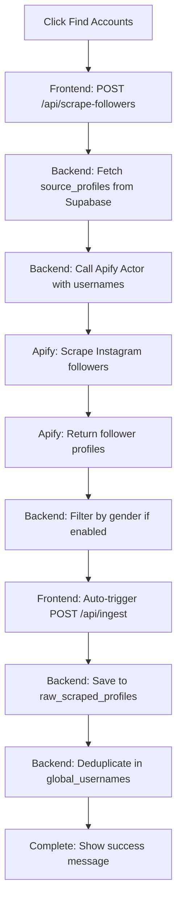

## Overview

The Click Creators Scraper Client uses [Apify](https://apify.com) to scrape Instagram followers from source accounts. Apify provides pre-built actors (web scraping tools) that handle Instagram's anti-bot mechanisms and rate limiting.

## Prerequisites

- An Apify account ([sign up here](https://apify.com/sign-up))
- Basic understanding of web scraping concepts
- Instagram source accounts to scrape from

## Step 1: Create an Apify Account

1. Go to [Apify Sign Up](https://apify.com/sign-up)
2. Create a free account (free tier includes trial credits)
3. Verify your email address
4. Log in to [Apify Console](https://console.apify.com)

<Info>
  Apify offers a free tier with $5 in monthly credits, suitable for testing. Production usage requires a paid plan.
</Info>

## Step 2: Get Your API Token

1. Navigate to **Settings → Integrations**
2. Find **"Personal API tokens"** section
3. Click **"Create new token"**
4. Name it: "Click Creators Scraper"
5. Copy the token (starts with `apify_api_...`)

<CodeGroup>
```bash Backend .env
# Apify API Token
APIFY_API_KEY=apify_api_XXXXXXXXXXXXXXXXXXXXXXXX
```
</CodeGroup>

<Warning>
  Keep your API token secret. Never commit it to version control or expose it in the frontend.
</Warning>

## Step 3: Choose an Instagram Scraper Actor

Apify has multiple Instagram scraping actors. Recommended options:

### Option A: Instagram Profile Scraper (Recommended)

**Actor:** `apify/instagram-profile-scraper`

**Features:**
- Scrapes follower lists
- Profile metadata (followers, following, bio)
- Handles pagination automatically
- Respects Instagram rate limits

**Pricing:** ~$0.25-0.50 per 1,000 profiles

### Option B: Custom Actor

You can create your own actor for specific needs:

1. Go to **Actors → Create new**
2. Choose **"Web Scraper"** template
3. Customize scraping logic
4. Publish actor

### Get Actor ID

1. Navigate to the actor page (e.g., `https://console.apify.com/actors/USERNAME~instagram-scraper`)
2. The Actor ID is in the URL: `USERNAME/instagram-scraper`
3. Or find it in **Settings → General → Actor ID**

<CodeGroup>
```bash Backend .env
# Actor ID (username/actor-name or actor-id)
APIFY_ACTOR_ID=apify/instagram-profile-scraper
# or
APIFY_ACTOR_ID=USERNAME/custom-instagram-scraper
```
</CodeGroup>

## Step 4: Configure Actor Input

The backend API sends input to the Apify actor when scraping. Example configuration:

<CodeGroup>
```json Actor Input
{
  "usernames": [
    "influencer1",
    "influencer2"
  ],
  "resultsLimit": 1000,
  "resultsType": "followers",
  "scrapeFollowerInfo": true,
  "scrapeFollowingInfo": false,
  "searchType": "hashtag",
  "searchLimit": 100
}
```

```python Backend API (Conceptual)
import os
from apify_client import ApifyClient

client = ApifyClient(os.getenv('APIFY_API_KEY'))

# Run actor
run = client.actor(os.getenv('APIFY_ACTOR_ID')).call(
    run_input={
        "usernames": ["example_account"],
        "resultsLimit": 1000,
        "resultsType": "followers"
    }
)

# Get results
for item in client.dataset(run["defaultDatasetId"]).iterate_items():
    print(f"Username: {item['username']}")
```
</CodeGroup>

## Step 5: Test Scraping

### From Apify Console

1. Open your Instagram scraper actor
2. Click **"Try for free"** or **"Run"**
3. Enter test input:
   ```json
   {
     "usernames": ["nike"],
     "resultsLimit": 50,
     "resultsType": "followers"
   }
   ```
4. Click **"Start"**
5. Wait for completion (1-5 minutes)
6. Check **"Results"** tab for scraped data

### From Your Application

1. Navigate to `/callum-dashboard` in the application
2. Click **"Edit Source Profiles"** in Dependencies Card
3. Add a test Instagram username (e.g., `nike`)
4. Click **"Find Accounts"** button
5. Monitor progress bar:
   - **Scraping (10-50%):** Calls Apify actor
   - **Ingesting (60-80%):** Saves to database
   - **Complete (100%):** Success

## Step 6: Understand the Scraping Workflow

The application follows this workflow when you click **"Find Accounts"**:



### API Endpoint: POST /api/scrape-followers

**Request:**
```json
{
  "accounts": ["influencer1", "influencer2"],
  "targetGender": "male"
}
```

**Response:**
```json
{
  "success": true,
  "data": {
    "accounts": [
      {
        "id": "12345678",
        "username": "john_doe",
        "full_name": "John Doe",
        "follower_count": 1500,
        "detected_gender": "male"
      }
    ],
    "totalScraped": 1000,
    "totalFiltered": 450,
    "genderDistribution": {
      "male": 450,
      "female": 400,
      "unknown": 150
    }
  }
}
```

## Configuration Options

### Gender Filtering

The application supports filtering scraped profiles by detected gender:

<ParamField path="GENDER_API_KEY" type="string">
  API key for gender detection service (e.g., Genderize.io, Gender API).
  
  **Used for:** Filtering male profiles from scraped followers
  
  If not provided, all profiles are included regardless of gender.
</ParamField>

**Gender Detection Flow:**

1. Apify scrapes follower profiles
2. Backend extracts first names from `full_name` field
3. Calls gender API to detect gender
4. Filters results based on `targetGender` parameter
5. Returns filtered profiles

<CodeGroup>
```python Gender Detection (Conceptual)
import requests

def detect_gender(name: str) -> str:
    """Detect gender from first name using external API"""
    api_key = os.getenv('GENDER_API_KEY')
    if not api_key:
        return 'unknown'
    
    response = requests.get(
        f'https://api.genderize.io/?name={name}&apikey={api_key}'
    )
    data = response.json()
    
    # Returns 'male', 'female', or 'unknown'
    return data.get('gender', 'unknown')

# Filter profiles
filtered = [
    profile for profile in scraped_profiles
    if detect_gender(profile['full_name'].split()[0]) == 'male'
]
```
</CodeGroup>

### Scraping Limits

Control how many followers to scrape per source account:

**In Backend API:**
```python
# Configurable limits
MAX_FOLLOWERS_PER_ACCOUNT = 1000  # Default
CONCURRENT_SCRAPES = 3  # Parallel scraping jobs
RETRY_ATTEMPTS = 3  # Retry failed scrapes
```

**Performance Considerations:**
- Scraping 1,000 followers takes ~2-5 minutes
- Scraping 10,000 followers takes ~20-50 minutes
- Instagram rate limits may slow down large scrapes

## Apify Credits and Pricing

### Free Tier
- **$5 in monthly credits** (resets each month)
- ~200-400 profiles scraped per month
- Good for testing and development

### Paid Plans

| Plan | Credits | Price | Approx. Profiles |
|------|---------|-------|------------------|
| **Starter** | $49/month | $49 | ~10,000-20,000 |
| **Team** | $249/month | $249 | ~50,000-100,000 |
| **Enterprise** | Custom | Custom | Unlimited |

**Actual cost depends on:**
- Actor used (different actors have different costs)
- Proxy usage (residential proxies cost more)
- Compute time (longer runs = higher cost)

### Monitor Usage

1. Go to **Usage → Dashboard** in Apify Console
2. Check **"Credits used"** and **"Remaining credits"**
3. View **"Actor runs"** to see individual scraping costs

<Info>
  Set up **billing alerts** in Apify to get notified when credits run low.
</Info>

## Troubleshooting

### "Apify actor failed to start"

**Possible causes:**

1. **Invalid API Key**
   - Verify `APIFY_API_KEY` in `.env`
   - Check token hasn't been revoked
   - Test with `curl`:
     ```bash
     curl -H "Authorization: Bearer YOUR_API_KEY" \
       https://api.apify.com/v2/acts
     ```

2. **Incorrect Actor ID**
   - Verify `APIFY_ACTOR_ID` format: `username/actor-name`
   - Check actor exists and is published
   - Ensure you have access to the actor

3. **Insufficient Credits**
   - Check Apify dashboard for remaining credits
   - Add credits or upgrade plan

### "Instagram blocking requests"

Instagram may block scraping if:
- Too many requests in short time
- Using datacenter proxies (Instagram detects them)
- Account flagged for automation

**Solutions:**

1. **Use Residential Proxies**
   - Apify offers proxy services
   - Add to actor input:
     ```json
     {
       "proxy": {
         "useApifyProxy": true,
         "apifyProxyGroups": ["RESIDENTIAL"]
       }
     }
     ```

2. **Add Delays**
   - Slow down scraping speed
   - Add random delays between requests

3. **Rotate Accounts**
   - Scrape from different source accounts
   - Don't scrape same account repeatedly

### "Scraping taking too long"

**Optimization tips:**

1. **Reduce Results Limit**
   ```json
   { "resultsLimit": 500 }  // Instead of 10000
   ```

2. **Parallel Scraping**
   - Run multiple actors in parallel
   - Backend should implement concurrent requests

3. **Use Faster Actors**
   - Some actors are optimized for speed
   - Check actor reviews and performance metrics

### "No profiles returned"

1. Check source account is **public** (private accounts can't be scraped)
2. Verify source account has followers
3. Check Apify run logs for errors
4. Ensure actor input is correct

## Best Practices

<Check>
  - Start with small scraping limits during testing
  - Monitor Apify credits usage regularly
  - Use residential proxies for production scraping
  - Implement retry logic for failed scrapes
  - Cache scraped data to avoid re-scraping
  - Respect Instagram's terms of service
</Check>

<Warning>
  Instagram's terms of service prohibit automated scraping. Use this tool responsibly and be aware of potential account restrictions.
</Warning>

## Next Steps

<CardGroup cols={2}>
  <Card title="Scraping Workflow" icon="magnifying-glass" href="/features/scraping-jobs">
    Learn how to scrape and ingest profiles
  </Card>
  
  <Card title="Campaign Workflow" icon="route" href="/features/campaign-management">
    Distribute scraped profiles to VAs
  </Card>
</CardGroup>
