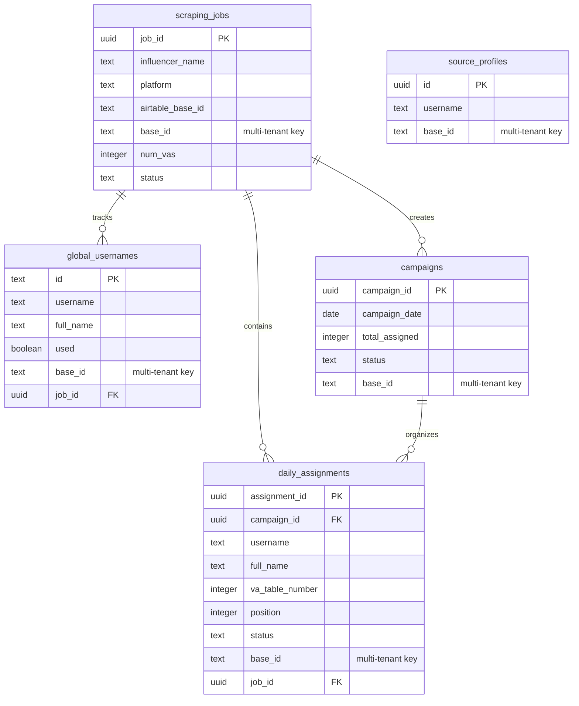

## Architecture Overview

The Click Creators Scraper Client uses **Supabase PostgreSQL** for data storage with built-in Row Level Security (RLS) for multi-tenant data isolation.

### Tech Stack

- **Database**: Supabase PostgreSQL
- **Security**: Row Level Security (RLS)
- **Real-time**: Supabase real-time subscriptions
- **Client**: `@supabase/supabase-js`

## Multi-Tenant Isolation

All data tables include a `base_id` column that ensures complete data isolation between different influencer campaigns:

```typescript
export function createSupabaseClientWithContext(baseId: string) {
  return createClient(
    supabaseUrl,
    supabaseAnonKey,
    {
      global: {
        headers: {
          'x-base-id': baseId  // RLS filtering by base_id
        }
      }
    }
  )
}
```

<Info>
The `base_id` corresponds to the Airtable base ID and is automatically set from the active scraping job's `airtable_base_id`.
</Info>

## Database Tables

The database consists of 6 core tables:

<CardGroup cols={2}>
  <Card title="scraping_jobs" icon="briefcase" href="/database/scraping-jobs">
    Multi-tenant job management for influencer campaigns
  </Card>
  
  <Card title="source_profiles" icon="user-group" href="/database/source-profiles">
    Instagram accounts to scrape followers from
  </Card>
  
  <Card title="global_usernames" icon="at" href="/database/global-usernames">
    Deduplicated username pool with usage tracking
  </Card>
  
  <Card title="campaigns" icon="calendar" href="/database/campaigns">
    Daily campaign tracking and status management
  </Card>
  
  <Card title="daily_assignments" icon="list-check" href="/database/daily-assignments">
    Profile-to-VA assignments for campaigns
  </Card>
</CardGroup>

## Entity Relationship Diagram



## Data Flow

The typical data flow through the database:

1. **Job Creation**: Create a scraping job in `scraping_jobs`
2. **Source Setup**: Add Instagram accounts to `source_profiles`
3. **Scraping**: Extract followers and store in `global_usernames`
4. **Campaign Creation**: Create campaign record in `campaigns`
5. **Distribution**: Distribute profiles to VAs in `daily_assignments`
6. **Tracking**: Mark usernames as used in `global_usernames`

## Key Metrics

- **Daily Target**: 14,400 unique profiles per campaign
- **VA Count**: 80 virtual assistants
- **Profiles per VA**: 180 per day
- **Campaign Lifecycle**: 7 days
- **Total Capacity**: 1.008M profiles/week

## Database Configuration

### Environment Variables

```bash
# Supabase Configuration
NEXT_PUBLIC_SUPABASE_URL=https://your-project.supabase.co
NEXT_PUBLIC_SUPABASE_ANON_KEY=your-anon-key-here

# Backend (Service Role)
SUPABASE_URL=https://your-project.supabase.co
SUPABASE_KEY=your-service-role-key
```

### Row Level Security (RLS)

All tables should have RLS policies enabled that filter by `base_id` from the request headers:

```sql
-- Example RLS policy for multi-tenant isolation
CREATE POLICY "Isolate by base_id" ON global_usernames
  FOR ALL
  USING (base_id = current_setting('request.headers')::json->>'x-base-id');
```

<Warning>
Ensure RLS policies are properly configured for all tables to prevent data leakage between different influencer campaigns.
</Warning>

## Connection Management

The application uses two types of Supabase clients:

1. **Standard Client**: For non-tenant-specific operations
   ```typescript
   import { supabase } from '@/lib/supabase'
   ```

2. **Context Client**: For multi-tenant operations
   ```typescript
   import { createSupabaseClientWithContext } from '@/lib/supabase'
   const client = createSupabaseClientWithContext(baseId)
   ```

## Next Steps

<CardGroup cols={2}>
  <Card title="Scraping Jobs Schema" icon="briefcase" href="/database/scraping-jobs">
    Learn about the scraping_jobs table structure
  </Card>
  
  <Card title="API Integration" icon="plug" href="/api/overview">
    Explore database API endpoints
  </Card>
</CardGroup>