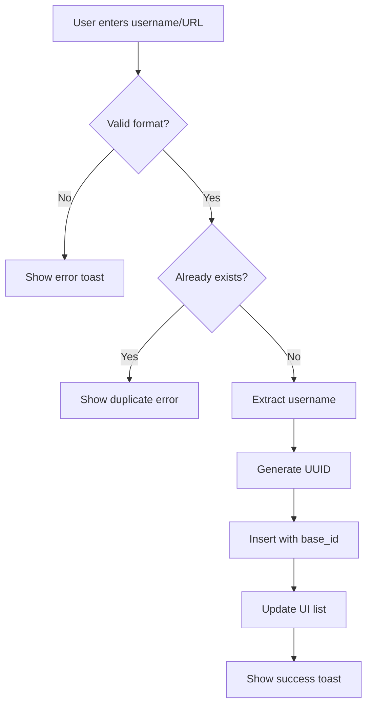

## Overview

Source profiles are the Instagram, TikTok, Threads, or X accounts from which you scrape followers. Managing these profiles efficiently ensures consistent, high-quality campaign results.

## What are Source Profiles?

Source profiles are stored in the `source_profiles` table with the following structure:

```sql
CREATE TABLE source_profiles (
  id UUID PRIMARY KEY DEFAULT uuid_generate_v4(),
  username TEXT NOT NULL,
  base_id TEXT NOT NULL,  -- Multi-tenant isolation
  created_at TIMESTAMP DEFAULT NOW()
);
```

Each profile is:
- **Isolated by base_id** - Only visible within the same scraping job
- **Reusable** - Load saved profiles for future campaigns
- **Platform-agnostic** - Works with Instagram, TikTok, Threads, and X

<Note>
Source profiles are **NOT** the followers you scrape. They are the accounts you scrape FROM. The followers become entries in `global_usernames`.
</Note>

## Accessing the Source Profiles Dialog

There are two ways to manage source profiles:

### Method 1: From Dashboard (Quick Access)

1. Navigate to your job dashboard (`/callum-dashboard?job={job_id}`)
2. In the **Find Accounts** card, click the **⋮** (three dots) menu
3. Select **"Edit source profiles"**

### Method 2: Direct Navigation

From `components/edit-source-profiles-dialog.tsx:334-340`:
```typescript
<Dialog open={open} onOpenChange={onOpenChange}>
  <DialogContent className="max-w-2xl max-h-[80vh]">
    <DialogTitle>Edit Source Profiles</DialogTitle>
    <DialogDescription>
      Add or remove Instagram accounts from your source profiles database.
    </DialogDescription>
```

## Adding Source Profiles

<Steps>
  <Step title="Open the Edit Source Profiles Dialog">
    Click **"Edit source profiles"** from the three-dots menu in the Find Accounts card.

    The dialog loads existing profiles for your current job's `base_id`.
  </Step>

  <Step title="Enter Account Information">
    In the **"Add New Profile"** section, you can enter either:

    ### Option 1: Username Only
    - Instagram: `cristiano` or `@cristiano`
    - TikTok: `charlidamelio` or `@charlidamelio`
    - X: `elonmusk` or `@elonmusk`
    - Threads: `zuck` or `@zuck`

    ### Option 2: Full URL
    - Instagram: `https://instagram.com/cristiano`
    - TikTok: `https://tiktok.com/@charlidamelio`
    - X: `https://x.com/elonmusk` or `https://twitter.com/elonmusk`
    - Threads: `https://threads.net/@zuck`

    <Tip>
    The system automatically extracts usernames from URLs, so you can paste directly from your browser.
    </Tip>
  </Step>

  <Step title="Submit the Profile">
    Press **Enter** or click the **+** button.

    From `components/edit-source-profiles-dialog.tsx:129-209`:
    ```typescript
    const addProfile = async () => {
      // Extract username from URL or validate username
      const username = extractUsername(inputValue)
      
      // Check for duplicates
      if (profiles.some(profile => profile.username === username)) {
        toast({ title: "Profile already exists" })
        return
      }
      
      // Insert into Supabase with base_id for multi-tenant isolation
      const { data } = await supabaseWithContext
        .from('source_profiles')
        .insert([{ 
          id: crypto.randomUUID(), 
          username,
          base_id: baseId 
        }])
    }
    ```

    The profile is immediately:
    - Saved to the `source_profiles` table
    - Linked to your job's `base_id`
    - Displayed in the profiles list
  </Step>

  <Step title="Verify Addition">
    The profile appears in the **"Source Profiles (N)"** list with:
    - Avatar with initials
    - Username display (`@username`)
    - Remove button (X icon)

    A success toast confirms: **"Profile added"**
  </Step>
</Steps>

## URL Validation and Extraction

The system uses platform-specific regex patterns to extract usernames:

### Instagram Pattern
From `components/edit-source-profiles-dialog.tsx:108-118`:
```typescript
const patterns = [
  /https?:\/\/(?:www\.)?instagram\.com\/([a-zA-Z0-9._]+)\/?(?:\?.*)?$/,
  /https?:\/\/(?:www\.)?instagram\.com\/([a-zA-Z0-9._]+)\/(?:\?.*)?$/,
]
```

**Valid examples:**
- `https://instagram.com/cristiano` ✅
- `https://www.instagram.com/cristiano/` ✅
- `https://instagram.com/cristiano?hl=en` ✅

**Invalid examples:**
- `https://facebook.com/cristiano` ❌ (wrong platform)
- `instagram.com/cristiano` ❌ (missing protocol)
- `cristiano@instagram.com` ❌ (email format)

### Username-Only Pattern
```typescript
const usernamePattern = /^[a-zA-Z0-9._]+$/
```

**Valid examples:**
- `cristiano` ✅
- `tech_influencer` ✅
- `user.name` ✅
- `user123` ✅

**Invalid examples:**
- `user name` ❌ (space)
- `user@name` ❌ (@ symbol not allowed in username-only mode)
- `user/name` ❌ (slash)

## Removing Source Profiles

<Steps>
  <Step title="Locate the Profile">
    In the **"Source Profiles"** list, find the profile you want to remove.

    Profiles are sorted alphabetically by username.
  </Step>

  <Step title="Click the Remove Button">
    Click the **X** icon next to the profile.

    From `components/edit-source-profiles-dialog.tsx:212-246`:
    ```typescript
    const removeProfile = async (id: string, username: string) => {
      // Create context-aware Supabase client
      const supabaseWithContext = createSupabaseClientWithContext(baseId)
      
      // Delete from database
      await supabaseWithContext
        .from('source_profiles')
        .delete()
        .eq('id', id)
      
      // Remove from local state
      setProfiles(prev => prev.filter(profile => profile.id !== id))
    }
    ```
  </Step>

  <Step title="Confirm Removal">
    The profile is immediately:
    - Removed from the database
    - Removed from the UI list
    - Confirmed with toast: **"Profile removed"**

    <Warning>
    Profile removal is **permanent** and **cannot be undone**. The profile will not appear in future "Load source profiles" operations.
    </Warning>
  </Step>
</Steps>

## Bulk Operations

### Clear All Profiles

<Warning>
This operation is **destructive** and requires password confirmation.
</Warning>

<Steps>
  <Step title="Click Clear All Button">
    In the profiles list header, click **"Clear All"**.

    This button is disabled if you have 0 profiles.
  </Step>

  <Step title="Enter Password">
    A password prompt appears:

    From `components/edit-source-profiles-dialog.tsx:249-261`:
    ```typescript
    const handleClearAll = async () => {
      const correctPassword = process.env.NEXT_PUBLIC_LOGIN_PASSWORD
      
      if (password !== correctPassword) {
        toast({ title: "Incorrect password" })
        return
      }
      
      // Delete all profiles for this base_id
      await supabaseWithContext
        .from('source_profiles')
        .delete()
        .eq('base_id', baseId)
    }
    ```

    Enter your application login password (from `NEXT_PUBLIC_LOGIN_PASSWORD`).
  </Step>

  <Step title="Confirm Deletion">
    Click **"Confirm Delete"** or press Enter.

    All profiles for the current job are:
    - Deleted from `source_profiles` table
    - Removed from the UI
    - Confirmed with toast: **"All profiles cleared"**

    <Note>
    This only deletes profiles for the **current job's base_id**. Profiles from other jobs remain untouched (multi-tenant isolation).
    </Note>
  </Step>
</Steps>

## Loading Source Profiles into Find Accounts

After saving profiles to the database, you can load them for scraping:

<Steps>
  <Step title="Navigate to Find Accounts Card">
    In your job dashboard, locate the **Find Accounts** card.
  </Step>

  <Step title="Open Menu and Load Profiles">
    1. Click the **⋮** (three dots) menu
    2. Select **"Load source profiles"**

    From `components/dependencies-card.tsx:258-332`:
    ```typescript
    const loadSourceProfiles = async () => {
      // Create context-aware Supabase client
      const supabaseWithContext = createSupabaseClientWithContext(baseId)
      
      // Query profiles for current base_id
      const { data } = await supabaseWithContext
        .from('source_profiles')
        .select('id, username')
        .eq('base_id', baseId)
        .order('username', { ascending: true })
      
      // Convert to local account format
      const loadedAccounts = data.map(profile => ({
        id: Date.now() + Math.random(),
        username: profile.username
      }))
      
      // Merge with existing accounts, avoiding duplicates
      setAccounts(prev => [...prev, ...newAccounts])
    }
    ```
  </Step>

  <Step title="Verify Loaded Profiles">
    Loaded profiles appear in the **"Added Accounts"** section.

    Success toast: **"Loaded N source profiles from database"**

    <Tip>
    Loaded profiles merge with any manually added accounts, automatically deduplicating by username.
    </Tip>
  </Step>
</Steps>

## Multi-Tenant Isolation

### How It Works

Every source profile is tagged with a `base_id` upon creation:

From `components/edit-source-profiles-dialog.tsx:176-184`:
```typescript
const { data } = await supabaseWithContext
  .from('source_profiles')
  .insert([{ 
    id: profileId, 
    username,
    base_id: baseId  // Tenant identifier
  }])
```

### Querying with Context

All queries use a context-aware Supabase client:

```typescript
// Create client with base_id in context
const supabaseWithContext = createSupabaseClientWithContext(baseId)

// Query automatically filters by base_id
const { data } = await supabaseWithContext
  .from('source_profiles')
  .select('id, username')
  .eq('base_id', baseId)  // Belt-and-suspenders approach
```

<Note>
The "belt-and-suspenders" approach uses BOTH:
1. Context-aware client (sets base_id in request context)
2. Explicit `.eq('base_id', baseId)` filter

This ensures **zero chance** of cross-tenant data leakage.
</Note>

## Best Practices

### Choosing Quality Source Accounts

1. **Large follower base:** Accounts with 100k+ followers provide more scraping options
2. **Active engagement:** Accounts with recent activity have more active followers
3. **Target audience match:** Choose accounts whose followers match your target demographic
4. **Public accounts only:** Private accounts cannot be scraped

### Organizing Profiles

1. **Save frequently used accounts:** Use the database to persist your go-to source accounts
2. **Remove inactive accounts:** Periodically clean up accounts that no longer exist or are private
3. **Test before bulk scraping:** Add 1-2 profiles first to verify they work
4. **Document your sources:** Keep notes on why you chose specific accounts (in external docs)

### Platform-Specific Tips

**Instagram:**
- Focus on verified accounts (blue checkmark) for quality followers
- Lifestyle and fashion accounts typically have engaged audiences
- Avoid accounts with suspicious follower spikes

**TikTok:**
- Choose creators with consistent posting schedules
- Viral accounts may have lower-quality followers
- Look for niche-specific creators

**X (Twitter):**
- Tech and news accounts have highly engaged followers
- Verified accounts (blue/gold checkmarks) provide better quality
- Avoid bot-heavy accounts (check engagement ratios)

**Threads:**
- New platform - focus on accounts migrated from Instagram
- Meta-verified accounts recommended
- Early adopters tend to be more engaged

## Troubleshooting

### "Profile already exists"

**Cause:** Username already saved in database for this job.

**Solution:** This is expected behavior. The duplicate check prevents redundant entries.

### "Failed to add profile"

**Causes:**
- No active job selected (missing `base_id`)
- Database connection lost
- Invalid characters in username

**Solutions:**
1. Verify a job is selected in the sidebar
2. Check Supabase connection in browser console
3. Ensure username contains only letters, numbers, dots, and underscores

### "No profiles found" when loading

**Cause:** No profiles saved for this job's `base_id`.

**Solution:** Add profiles via "Edit source profiles" first, then try loading again.

### Profiles not loading from database

**Debugging steps:**

1. **Verify base_id:**
   ```typescript
   console.log('Current baseId:', baseId)
   ```

2. **Check database:**
   ```sql
   SELECT * FROM source_profiles WHERE base_id = 'your_base_id';
   ```

3. **Verify RLS policies:**
   - Ensure `source_profiles` table has proper Row Level Security
   - Check policies allow read access for your role

## Source Profile Workflow



## Data Isolation Guarantee

From `contexts/base-context.tsx:11-13`:
```typescript
interface BaseContextType {
  activeJob: ScrapingJob | null
  baseId: string | null  // Source of truth for tenant isolation
  airtableBaseId: string | null
}
```

Every operation:
1. Retrieves `baseId` from BaseContext
2. Creates context-aware Supabase client
3. Filters queries by `base_id`
4. Ensures zero cross-tenant data leakage

<Note>
You can have multiple scraping jobs running simultaneously. Source profiles are **completely isolated** by `base_id`, so profiles from Job A will **never** appear in Job B.
</Note>

## Next Steps

<CardGroup cols={2}>
  <Card title="Running Campaigns" icon="rocket" href="/guides/running-campaigns">
    Use your source profiles to scrape followers and run campaigns
  </Card>
  <Card title="Multi-Tenant Setup" icon="building" href="/guides/multi-tenant-setup">
    Understand how base_id isolation works across the platform
  </Card>
</CardGroup>

## Database Schema Reference

<Card title="source_profiles Table" icon="database" href="/database/source-profiles">
  Complete schema documentation for the source_profiles table
</Card>