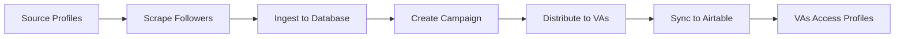

## Overview

Campaigns are the execution layer of your scraping workflow. A campaign represents a single distribution of profiles to your Virtual Assistants (VAs), tracked from scraping through Airtable sync.

## Campaign Lifecycle



## Prerequisites

Before running a campaign:

- [x] Active scraping job selected in dashboard
- [x] Source profiles added (at least 1)
- [x] Sufficient Apify credits for scraping
- [x] Airtable base properly configured

<Note>
Campaigns require an active `base_id` from BaseContext. Always verify a job is selected in the sidebar before starting.
</Note>

## Step 1: Scraping Followers

<Steps>
  <Step title="Navigate to Job Dashboard">
    Select your job from the sidebar or navigate to `/callum-dashboard?job={job_id}`.

    You'll see:
    - **Username Status Card** - Shows available profiles count
    - **Find Accounts Card** - Source profile management and scraping
    - **Extracted Accounts Table** - Results display
    - **Campaigns Table** - Campaign history
  </Step>

  <Step title="Add Source Profiles">
    In the **Find Accounts** card, you have two options:

    ### Option 1: Manual Entry
    1. Enter an Instagram/TikTok username or full URL
    2. Click the **+** button or press Enter
    3. Repeat for multiple accounts

    **Supported formats:**
    - Username: `@cristiano` or `cristiano`
    - Instagram URL: `https://instagram.com/cristiano`
    - TikTok URL: `https://tiktok.com/@charlidamelio`
    - X URL: `https://x.com/elonmusk`
    - Threads URL: `https://threads.net/@zuck`

    ### Option 2: Load from Database
    1. Click the **⋮** (three dots) menu
    2. Select **"Load source profiles"**
    3. Previously saved profiles load into the list

    <Tip>
    Save frequently used source profiles to the database for faster campaign setup. Use **"Edit source profiles"** to manage your saved list.
    </Tip>
  </Step>

  <Step title="Configure Scrape Count">
    Set the total number of accounts to scrape in the **"Total Accounts to Scrape"** input.

    **Example:**
    - 1 source account, 1,000 total → ~1,000 followers per account
    - 5 source accounts, 1,000 total → ~200 followers per account (distributed)

    ### Cost Estimation
    The card automatically calculates estimated cost based on platform rates:

    | Platform | Rate | Example (1,000 profiles) |
    |----------|------|-------------------------|
    | Instagram | $1.55/1k | $1.55 |
    | TikTok | $2.00/1k | $2.00 |
    | X | $0.15/1k | $0.15 |
    | Threads | $1.55/1k | $1.55 |

    <Warning>
    Verify you have sufficient Apify credits before clicking "Find Accounts". Check your balance at [Apify Console](https://console.apify.com/billing/current-period).
    </Warning>
  </Step>

  <Step title="Start Scraping">
    Click **"Find Accounts"** to begin the scraping process.

    ### Progress Phases

    **Phase 1: Scraping (0% → 50%)**
    - Calls Apify Instagram/TikTok scraper
    - Extracts followers from all source accounts
    - Applies gender detection (male filtering)
    - Shows "📡 Scraping followers..." progress

    From `components/dependencies-card.tsx:374-394`:
    ```typescript
    const result = await apiPost('/api/scrape-followers', baseId, {
      accounts: usernames,
      targetGender: 'male',
      totalScrapeCount: totalScrapeCount,
      platform: platform
    })
    ```

    **Phase 2: Ingesting (50% → 100%)**
    - Auto-triggered after scraping completes
    - Saves to `raw_scraped_profiles` table
    - Deduplicates in `global_usernames` table
    - Shows "💾 Saving to database..." progress

    From `components/dependencies-card.tsx:398-421`:
    ```typescript
    const ingestResult = await apiPost('/api/ingest', baseId, {
      profiles: result.data.accounts.map(account => ({
        id: account.id,
        username: account.username,
        full_name: account.fullName
      }))
    })
    ```

    <Note>
    Ingestion happens automatically after scraping. You don't need to trigger it manually.
    </Note>
  </Step>

  <Step title="Review Results">
    After completion (100%), the **Extracted Accounts** table populates with:
    - Profile ID
    - Full Name
    - Username
    - Gender (male filtered)

    The table supports:
    - Pagination (10 items per page)
    - Total count display
    - Real-time updates
  </Step>
</Steps>

## Step 2: Distributing to VAs

<Steps>
  <Step title="Check Username Pool Status">
    Before assigning to VAs, verify the **Username Status Card** shows:

    ✅ **Ready (Grey badge):** ≥14,400 unused profiles (for 180 per VA × 80 VAs)
    
    ⚠️ **Warning (Red badge):** &lt;14,400 profiles (insufficient for full distribution)

    From `components/username-status-card.tsx:47-55`:
    ```typescript
    const { count } = await supabase
      .from('global_usernames')
      .select('*', { count: 'exact', head: true })
      .eq('base_id', baseId)
      .eq('used', false)
    ```
  </Step>

  <Step title="Choose Assignment Method">
    In the **Extracted Accounts** table header, click the **⋮** (three dots) menu.

    You'll see two options:

    ### Option 1: Fixed 180 per VA
    - Distributes exactly 180 profiles to each VA
    - Requires **14,400 total** profiles (180 × 80 VAs)
    - Shows confirmation dialog before proceeding
    - Checks availability automatically

    ### Option 2: Custom Assignment
    - Opens dialog to set custom profiles per VA
    - Default: Value from `NEXT_PUBLIC_PROFILES_PER_TABLE` env variable (180)
    - Useful for smaller campaigns or testing
    - Example: 50 profiles × 10 VAs = 500 total

    <Tip>
    For your first campaign, use **Custom Assignment** with 10-20 profiles to test the entire workflow before committing to a full 14,400 profile distribution.
    </Tip>
  </Step>

  <Step title="Confirm and Start Distribution">
    After selecting an assignment method:

    1. **Availability check** (for Fixed 180 only)
       - Queries `global_usernames` table
       - Verifies ≥14,400 unused profiles
       - Shows error if insufficient

    2. **Campaign creation** begins with 3-phase progress:

    From `components/payments-table.tsx:108-189`:
    ```typescript
    // Phase 1: Creating campaign (0% → 33%)
    const selectionResult = await apiPost('/api/daily-selection', baseId, {
      profiles_per_table: profilesPerTableToUse
    })

    // Phase 2: Distributing to VAs (33% → 66%)
    const distributeResult = await apiPost(
      `/api/distribute/${campaignId}`, 
      baseId,
      { profiles_per_table: profilesPerTableToUse }
    )

    // Phase 3: Syncing to Airtable (66% → 100%)
    const syncResult = await apiPost(
      `/api/airtable-sync/${campaignId}`, 
      baseId
    )
    ```
  </Step>

  <Step title="Monitor Progress">
    Watch the global progress bar at the top of the screen:

    **📋 Creating campaign and selecting profiles... (0-33%)**
    - Creates entry in `campaigns` table
    - Selects N unused profiles from `global_usernames`
    - Marks selected profiles as `used = true`
    - Returns `campaign_id` for next steps

    **🎲 Distributing to VA tables... (33-66%)**
    - Splits profiles into VA table assignments
    - Creates entries in `daily_assignments` table
    - Each VA gets equal number of profiles
    - Assigns `va_table_number` (1 to 80)

    **☁️ Syncing to Airtable... (66-100%)**
    - Pushes profiles to corresponding Airtable tables
    - Each VA table receives its assigned profiles
    - Creates records with username, full name, and metadata
    - Respects Airtable API rate limits (5 req/sec)

    <Warning>
    Do not navigate away from the page during distribution. The process cannot be paused or resumed.
    </Warning>
  </Step>

  <Step title="Verify Completion">
    When progress reaches 100%, you'll see:

    - ✅ Success toast: "Campaign completed"
    - Updated campaigns table with new entry
    - Refreshed username status (lower available count)
    - VAs can now access profiles in Airtable

    ### Verify in Airtable
    1. Open your Airtable base
    2. Navigate to each VA table (Table 1, Table 2, etc.)
    3. Verify each has the correct number of records
    4. Check fields: ID, Username, Full Name, Status
  </Step>
</Steps>

## Campaign Status Indicators

In the **Campaigns** tab, campaigns are color-coded:

| Status | Color | Meaning |
|--------|-------|----------|
| **Success** | 🟢 Green | All phases completed successfully |
| **Failed** | 🔴 Red | Error during creation, distribution, or sync |
| **Pending** | ⚪ Grey | Campaign in progress |

From the README (`README.md:233-236`):
```
- 🟢 Green (Success) - Campaign completed successfully
- 🔴 Red (Failed) - Campaign failed
- ⚪ Grey (Pending) - Campaign in progress
```

## Campaign Lifecycle Management

### 7-Day Cleanup

Campaigns older than 7 days are automatically cleaned up:

- Profiles marked as `used = false` (returned to pool)
- Campaign status updated to `archived`
- Daily assignments preserved for historical tracking

**Cron job configuration:**
```bash
0 2 * * * curl -X POST http://localhost:5001/api/cleanup
```

<Note>
This ensures your username pool doesn't get permanently depleted. Profiles become available for future campaigns after 7 days.
</Note>

## Troubleshooting

### Scraping Phase Errors

**Error: "Scraping failed"**

**Causes:**
- Backend API not running
- Invalid Apify credentials
- Source accounts are private
- Insufficient Apify credits

**Solutions:**
1. Verify backend is running: `python api.py`
2. Check `APIFY_API_KEY` in `.env`
3. Ensure source accounts are public
4. Check Apify console for quota

### Distribution Phase Errors

**Error: "Not enough profiles"**

**Cause:** Insufficient unused profiles in `global_usernames` table.

**Solution:**
```sql
-- Check unused profile count
SELECT COUNT(*) 
FROM global_usernames 
WHERE base_id = 'your_base_id' AND used = false;
```

If count < required amount, run more scraping jobs.

**Error: "Distribution failed"**

**Causes:**
- Database connection lost
- Invalid campaign_id
- Concurrent campaign running

**Solutions:**
1. Verify Supabase connection
2. Check backend logs for errors
3. Wait for other campaigns to complete

### Airtable Sync Errors

**Error: "Airtable sync failed"**

**Causes:**
- Invalid Airtable API key
- Base ID mismatch
- VA tables don't exist
- Rate limit exceeded

**Solutions:**
1. Verify `AIRTABLE_API_KEY` in backend `.env`
2. Check base_id matches job's `airtable_base_id`
3. Verify all VA tables exist (Table 1 - Table N)
4. Wait 60 seconds and retry (rate limit cooldown)

## Best Practices

### Scraping Optimization

1. **Batch source accounts:** Add 5-10 source accounts per scraping run for diversity
2. **Monitor costs:** Always check Apify balance before large scrapes
3. **Test first:** Start with 100-500 profiles to verify gender filtering accuracy
4. **Save profiles:** Use "Edit source profiles" to persist frequently used accounts

### Distribution Strategy

1. **Start small:** Test with 10 VAs × 20 profiles before scaling to 80 VAs
2. **Timing:** Run campaigns during off-peak hours for faster Airtable sync
3. **Monitoring:** Watch the progress bar - errors show immediately
4. **Verification:** Always verify first VA table after sync before assuming success

### Campaign Management

1. **Track history:** Use Campaigns table to monitor success rate
2. **Cleanup awareness:** Remember profiles become available after 7 days
3. **Avoid overlaps:** Wait for campaigns to complete before starting new ones
4. **Base isolation:** Never mix profiles between different scraping jobs (base_ids)

## Key Metrics

From README (`README.md:88-94`):

- **Daily Target:** 14,400 unique male profiles
- **VA Count:** 80 virtual assistants
- **Profiles per VA:** 180 per day
- **Campaign Lifecycle:** 7 days
- **Total Capacity:** 1.008M profiles/week

## Next Steps

<CardGroup cols={2}>
  <Card title="Manage Source Profiles" icon="database" href="/guides/managing-source-profiles">
    Save and organize source accounts for faster campaign setup
  </Card>
  <Card title="Multi-Tenant Setup" icon="building" href="/guides/multi-tenant-setup">
    Understand data isolation and managing multiple jobs
  </Card>
</CardGroup>

## API Reference

<CardGroup cols={3}>
  <Card title="Scrape Followers" icon="code" href="/api/scrape-followers">
    POST /api/scrape-followers
  </Card>
  <Card title="Daily Selection" icon="code" href="/api/daily-selection">
    POST /api/daily-selection
  </Card>
  <Card title="Distribute" icon="code" href="/api/distribute">
    POST /api/distribute/:id
  </Card>
</CardGroup>